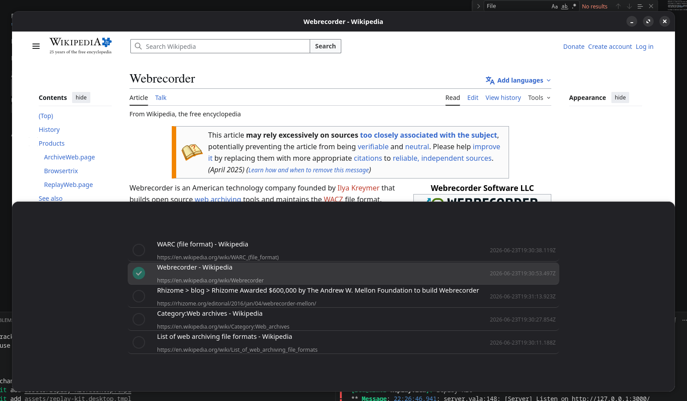

Replay-Kit
==========

Replay Web Archives on Desktop.

<div style="width:40%; margin: 0;">



</div>
</br>


## Summary

Replay-Kit is a simple tool that allows users to browse Web Archives offline.
Build for Gnome desktop environment, and is capable of replaying **Wacz archives only**. Warc, Har, MHTML or other web archive formats may be added in the future.
Makes use of [replayweb.page](https://replayweb.page/docs/embedding/) and WebKit.

</br>

## Complile & Install

At the moment no binaries or flatpak are provided. 

To compile and install `make` and `valac` compiler are used. 

```bash
# Compile application
make

# Run application without installing 
./build/replay-kit

# Or by providing path to wacz archive 
./build/replay-kit ~/Download/example.wacz

# Install application
sudo make install
```

